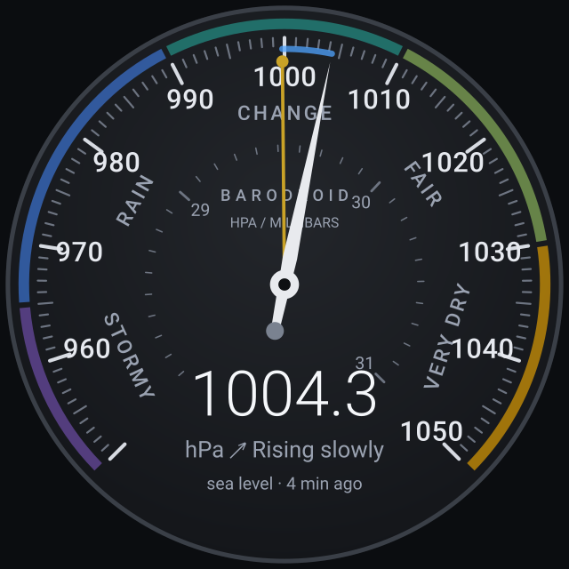

# BaroDroid

An Android barometer: it reads the phone's pressure sensor and plots it onto an
old-school aneroid weather-glass dial — 950–1050 hPa on the outer scale, 28–31
inHg inside it, the classic STORMY / RAIN / CHANGE / FAIR / VERY DRY lettering,
and a brass set-hand marking where the needle stood three hours ago. The
instrument is traditional; the drawing is not — flat colour, hairline ticks,
Material You theming and a digital readout in the gap at the bottom of the scale.



## What it does

- **Live dial** — the needle animates to the current reading; the blue arc shows
  how far the pressure has travelled in the last three hours.
- **Tendency** — a least-squares fit over the three-hour window, bucketed the way
  a forecaster would say it ("Falling slowly", "Rising rapidly", …). Fitting a
  line rather than differencing two samples keeps phone-sensor noise out of it.
- **Outlook** — the Zambretti forecaster, the algorithm behind the 1915 Negretti &
  Zambra forecasting slide rule, from sea-level pressure, tendency and season.
- **History** — 48 hours of samples kept in a small CSV in internal storage, drawn
  as a barograph trace over 6, 24 or 48 hours.
- **Units** — hPa, mb, inHg, mmHg or kPa, with optional sea-level correction for
  your altitude.
- **Two widgets** — the full dial (square, resizable) and a wide pressure strip
  with the reading, the tendency and the last 24 hours as a trace.

## The background-sensor catch

Since Android 9, an app that is not visible gets no events from continuous
sensors, and the barometer is one. So:

- while the app is open, it samples once a minute;
- a WorkManager job tries every 15/30/60 minutes and succeeds when the system
  allows it;
- for an unbroken graph there is an opt-in foreground service ("Keep logging in
  the background" in settings) with a quiet ongoing notification.

Nothing leaves the device: no network permission is requested, and the app has no
network code.

## Building

```bash
./gradlew assembleDebug        # APK in app/build/outputs/apk/debug
./gradlew testDebugUnitTest    # unit tests
./gradlew lintDebug
```

Requirements: JDK 17 or newer (the CI uses 21), Android SDK with API 35, and the
Gradle wrapper that ships with the repo — Gradle 8.14.3, the newest release the
Android Gradle Plugin 8.7 supports. `minSdk` is 26.

CI (`.github/workflows/android.yml`) validates the wrapper, runs the tests, lints
and assembles the debug APK on every push, and uploads the APK and reports as
artifacts. A second, non-blocking job builds against whatever Gradle release is
current, as an early warning for the next upgrade. A third publishes releases —
see below.

## Releases

Tag a commit and the pipeline does the rest:

```bash
git tag v1.0.0 && git push origin v1.0.0
```

The release job builds `assembleRelease`, names the APK after the tag, stamps the
version into it (`1.0.0`, version code `10000`), renders a QR code pointing at the
APK's download URL, writes the notes from the commits since the previous tag, and
publishes the lot as a GitHub release. The notes lead with the QR code, so getting
the build onto a phone is: open the release, point the phone at the screen.

A tag of the form `v1.2.3-beta.1` is published as a pre-release.

You can also cut a release from the Actions tab without touching git: **Actions →
Android CI → Run workflow**, pick the branch, and type the tag (`v1.0.0`) into
*release_tag*. The job creates the tag on that commit and publishes the release.

To rehearse without publishing anything, run the workflow manually and leave
*release_tag* empty, or put `[release-dry-run]` in a commit message. Either way the
same APK, QR code and notes are produced and attached to the run as artifacts, and
no release is created.

### Signing

With no secrets configured the release APK is signed with the standard debug key —
installable, but Android treats it as an unknown-source app and it cannot be
installed over a copy signed with a different key. The release notes say so when
that happens. To sign properly, add four repository secrets:

| Secret | What it holds |
| --- | --- |
| `ANDROID_KEYSTORE_BASE64` | the keystore file, base64-encoded (`base64 -w0 release.jks`) |
| `ANDROID_KEYSTORE_PASSWORD` | keystore password |
| `ANDROID_KEY_ALIAS` | key alias inside the keystore |
| `ANDROID_KEY_PASSWORD` | password for that key |

Locally the same four are read from the environment (`BARODROID_KEYSTORE_FILE`,
`BARODROID_KEYSTORE_PASSWORD`, `BARODROID_KEY_ALIAS`, `BARODROID_KEY_PASSWORD`), so
`./gradlew assembleRelease` signs the same way when they are set.

## Layout

```
core/      pure Kotlin: units, barometric maths, tendency, Zambretti, dial scale
domain/    BarometerSnapshot — one derived view of the data for app and widgets
data/      CSV history store, DataStore-backed settings
sensor/    TYPE_PRESSURE wrapper (flow + single-shot read)
render/    Canvas renderers for the dial, the graph and the widget strip
ui/        Compose screens, which draw through the same renderers
widget/    Glance widgets, which draw the same renderers into bitmaps
work/      periodic sampling
service/   optional foreground logging
```

The renderers take a plain `android.graphics.Canvas`, so the app screen and the
widgets are drawing the same pixels from the same code and cannot drift apart.

`docs/dial-dark.svg` and `docs/dial-light.svg` are design mocks generated from
the renderer's own geometry — handy for reviewing the face without a device.

## Tests

`app/src/test` covers the parts worth being sure about: unit conversion and
formatting, the sea-level correction and its inverse, the tendency fit (including
noisy input and short windows), the Zambretti tables (monotonic in pressure, never
rosier when falling than when rising) and snapshot assembly.
